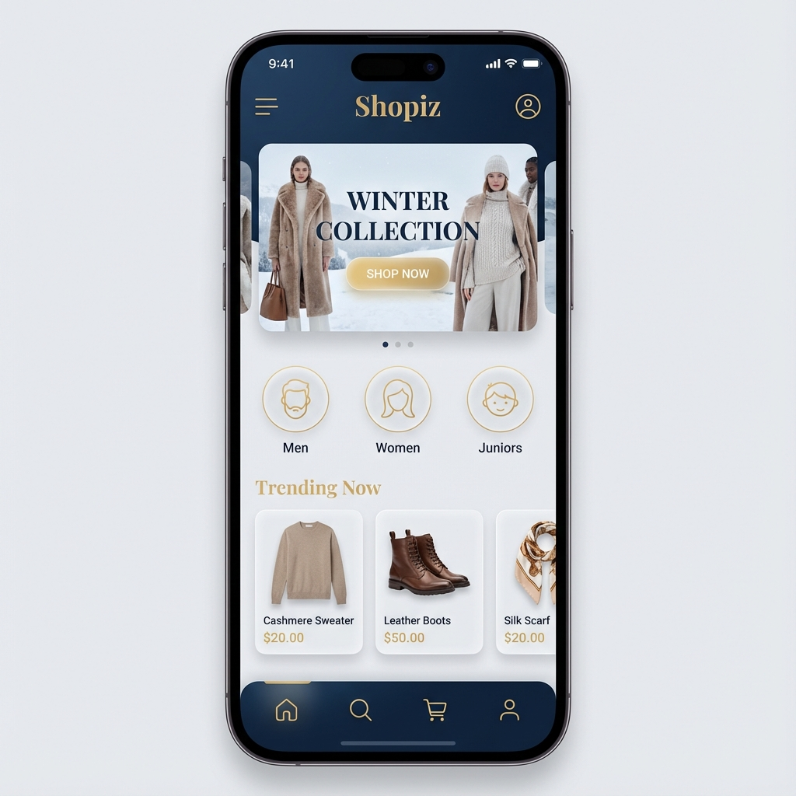
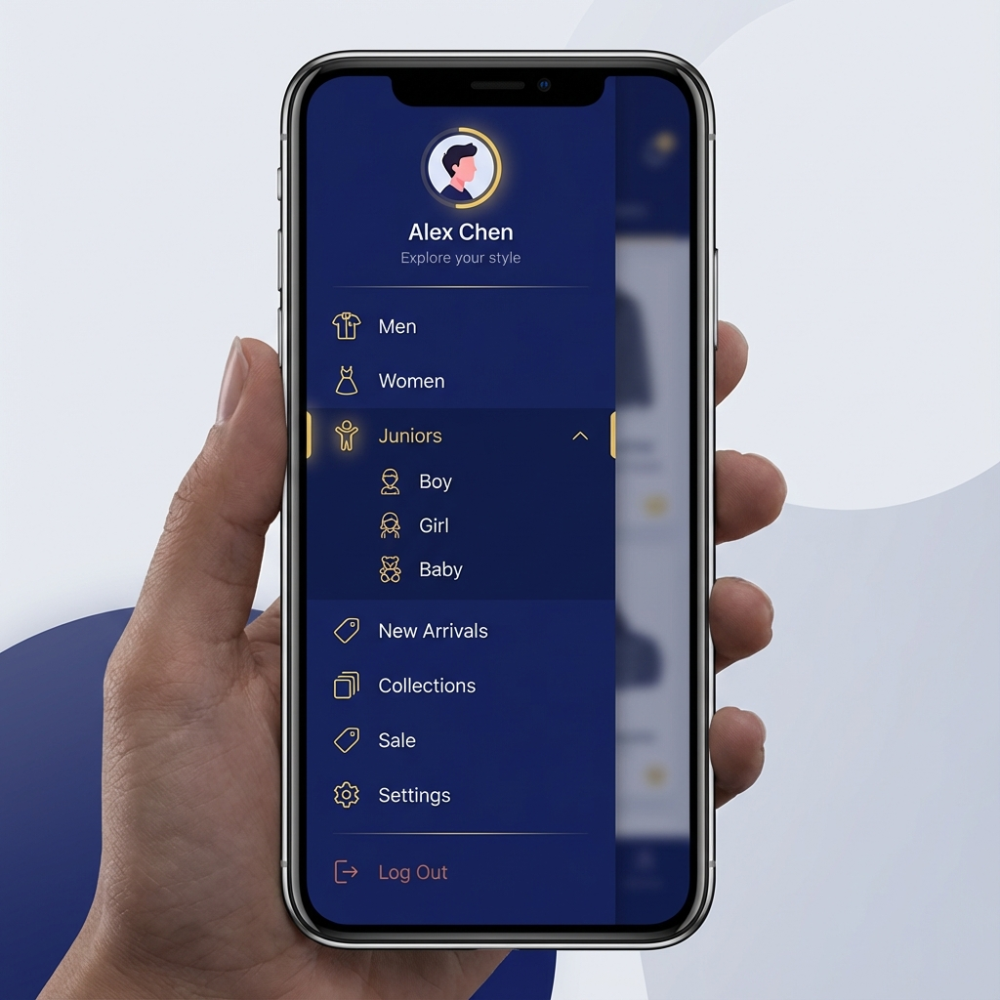
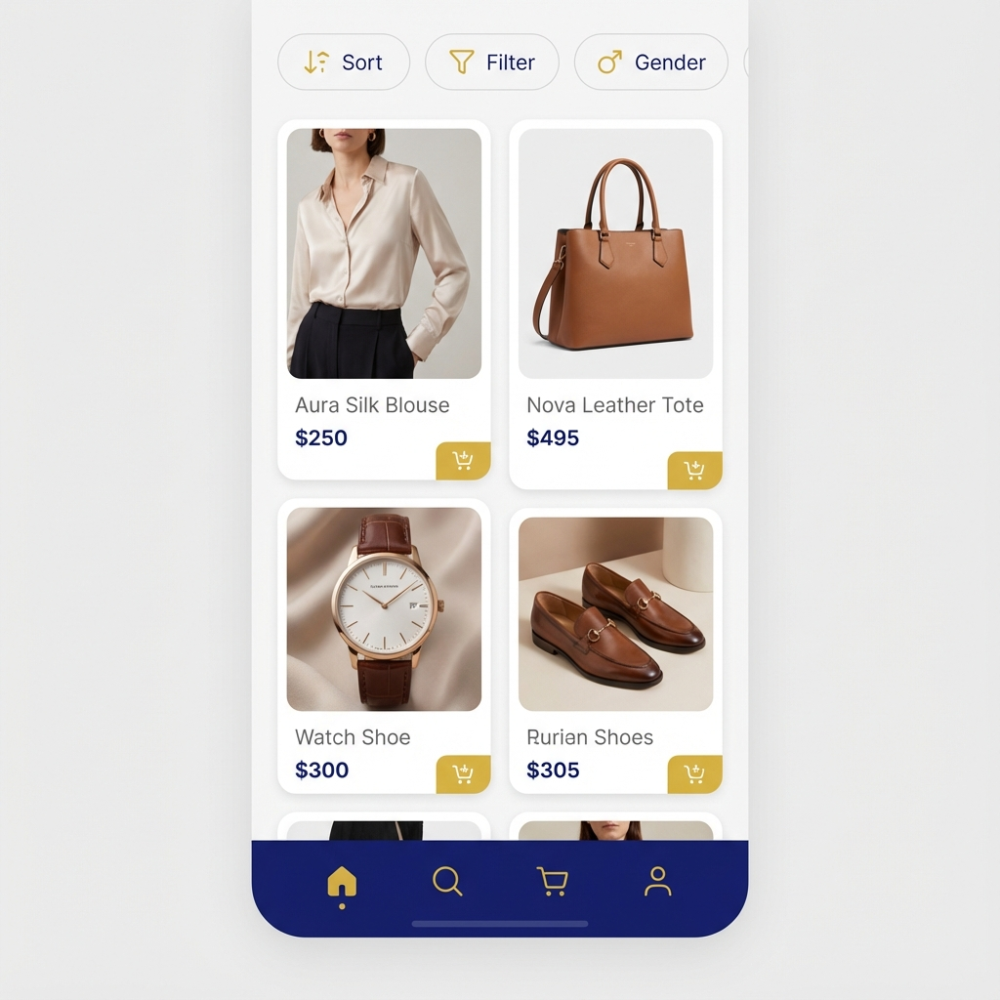

# Shopiz - Comprehensive Development Roadmap

## 1. Executive Summary
**Goal:** Build a scalable, premium, and high-performance e-commerce mobile application.
**Current State:** Functional frontend prototype with mock data.
**Target State:** Full-stack production-ready application with real-time data, secure payments, and user management.

---

## 2. Technology Stack Strategy

### Frontend (Mobile App)
*   **Framework:** Flutter (Dart)
*   **State Management:** GetX (Current) -> *Consider transitioning to BLoC or Riverpod for larger scale if needed, but GetX is sufficient for now.*
*   **Navigation:** GetX Navigation.
*   **Local Storage:** Hive or SharedPreferences (for caching and simple persistence).

### Backend (Server & API) - *Proposed*
*   **Runtime:** Node.js
*   **Framework:** Express.js (Lightweight, flexible) or NestJS (Structured, scalable).
*   **Language:** TypeScript (for type safety matching Dart).
*   **Authentication:** Firebase Auth (for ease of use) or Custom JWT (for control).

### Database
*   **Primary DB:** PostgreSQL (Relational DB is best for structured order/inventory data).
*   **Caching:** Redis (for session management and product caching).
*   **Storage:** AWS S3 or Firebase Storage (for product images).

---

## 3. Frontend Roadmap (Detailed)

### Phase 1: UI/UX Overhaul (The "Premium" Feel)
*   **Objective:** Implement the new "Midnight Blue (#2596be) & Gold (#c5a76e)" design language.
*   **Tasks:**
    *   [ ] **Design System:** Create a `ThemeData` file with new color palette, typography (Poppins/Lato), and component styles.
    *   [ ] **Home Screen:** Rebuild with glassmorphism headers, new banner carousel, and animated category chips.
    *   [ ] **Animations:** Add `Hero` animations for product transitions and `StaggeredListView` for product grids.

### Phase 2: Core Shopping Logic
*   **Objective:** Make the app functional for a user session.
*   **Tasks:**
    *   [ ] **Cart Management:**
        *   Implement local cart storage (persist across app restarts).
        *   Logic for updating quantities and calculating totals (subtotal, tax, shipping).
    *   [ ] **Checkout Flow:**
        *   **Step 1: Address:** Address form with validation.
        *   **Step 2: Payment:** UI for card entry (Stripe integration placeholder).
        *   **Step 3: Review:** Final order summary screen.

### Phase 3: User Accounts
*   **Objective:** Personalization and data persistence.
*   **Tasks:**
    *   [ ] **Auth Screens:** Redesign Login/Signup with social login buttons (Google/Apple).
    *   [ ] **Profile Dashboard:** Order history, saved addresses, wishlist management.
    *   [ ] **Wishlist:** Toggle logic and "Move to Cart" feature.

---

## 4. Backend Roadmap (Detailed)

### Phase 1: API Foundation
*   **Objective:** Set up the server and database connection.
*   **Tasks:**
    *   [ ] Initialize Node.js/Express project with TypeScript.
    *   [ ] Set up PostgreSQL database with Docker.
    *   [ ] Configure Swagger/OpenAPI for API documentation.

### Phase 2: Database Schema Design
*   **Users Table:** `id`, `email`, `password_hash`, `name`, `role` (customer/admin).
*   **Products Table:** `id`, `name`, `description`, `price`, `stock_quantity`, `category_id`, `images` (array).
*   **Categories Table:** `id`, `name`, `parent_id` (for subcategories).
*   **Orders Table:** `id`, `user_id`, `status` (pending, paid, shipped), `total_amount`, `created_at`.
*   **OrderItems Table:** `id`, `order_id`, `product_id`, `quantity`, `price_at_purchase`.

### Phase 3: API Endpoints Implementation
*   **Auth:**
    *   `POST /auth/register`
    *   `POST /auth/login`
    *   `GET /auth/me`
*   **Products:**
    *   `GET /products` (with pagination, sort, filter query params).
    *   `GET /products/:id`
*   **Cart/Orders:**
    *   `POST /orders` (Create new order).
    *   `GET /orders/my-orders` (User history).

---

## 5. Integration & Deployment

### Phase 1: Integration
*   **Tasks:**
    *   Replace Flutter mock repositories with `Dio` or `Http` service calls to the Node.js backend.
    *   Handle loading states, error handling, and offline capabilities.

### Phase 2: Admin Panel (Web)
*   **Objective:** Manage inventory and orders.
*   **Tech:** React or Flutter Web.
*   **Features:** Dashboard for sales stats, Product CRUD (Create, Read, Update, Delete), Order status management.

---

## 6. Milestones & Timeline (Estimated)

| Milestone | Deliverable | Est. Duration |
| :--- | :--- | :--- |
| **M1** | UI Redesign & Local Cart | 1-2 Weeks |
| **M2** | Backend Setup & DB Schema | 1 Week |
| **M3** | API Implementation (Products/Auth) | 2 Weeks |
| **M4** | Frontend-Backend Integration | 2 Weeks |
| **M5** | Checkout & Payments (Stripe) | 2 Weeks |
| **M6** | Testing & Polish | 1 Week |

**Total Estimated Time:** 9-10 Weeks for MVP Release.

---

## 7. Design Mockups

**Home Screen Concept**

**Navigation Drawer Concept**

**Shop Screen Concept**

**Item View Concept**

